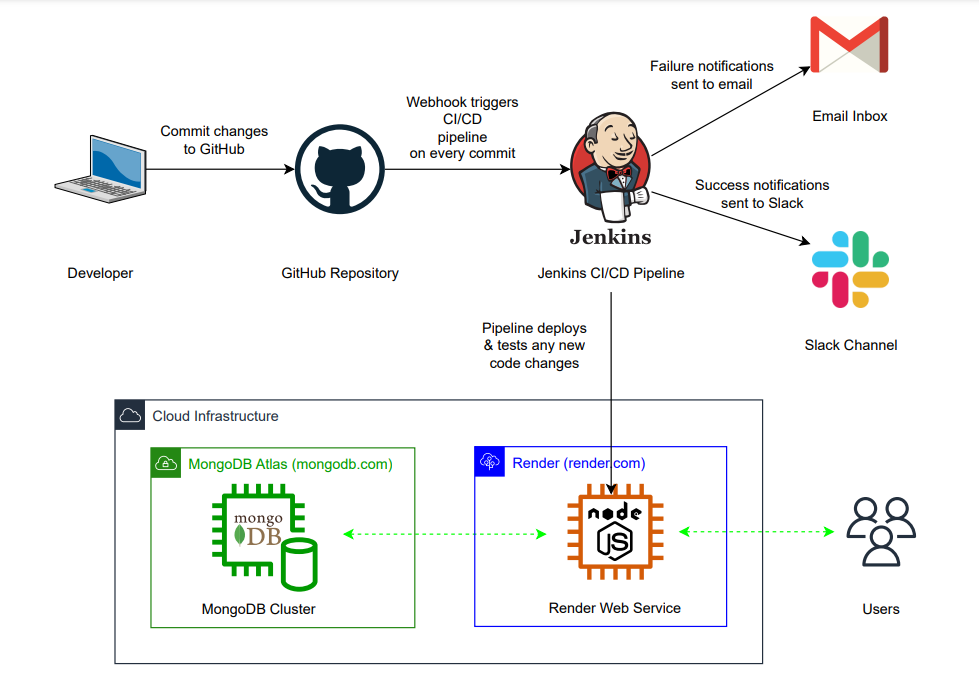

# Automated Deployment of a Nodejs App using Jenkins

The goal of this project was to streamline deployment and testing of a Nodejs application. Jenkins was used to achieve this as well as deliver status reports via Email and Slack. The app is hosted on Render and the database is MongoDB Atlas.

The app can be accessed here: https://my-ip1-node-app.onrender.com/

NOTE: The app may take about 30 sec to start since free instances on Render spin down due to inactivity.

## Architecture Diagram

## Procedure
Setting up the github webhook to trigger   the pipeline after any commit:

    + Install <a href="https://ngrok.com/docs">ngrok</a>
    + Use ngrok to create a public URL for
      the Jenkins container running locally
    + Add the URL as a github webhook

Set up the MongoDB database:

    + Create a cloud-hosted MongoDB cluster
      on MongoDB Atlas
    + Add the connection string to the
      _config.js and server.js files

Configure the Jenkins pipeline:

    + Build triggers: Ensure "GitHub hook
      trigger for GITScm polling" is selected
    + Pipeline: Ensure the "Pipeline script
      from SCM" option is selected and set the
      SCM as "Git". Include the URL to the
      github repository that you configured
      the webhook on and specify the branch
      that the pipeline will be triggered
      from.
    + Set the script path as the name of the
      pipeline configuration file. In my case,
      it was "Jenkinsfile"

Set up a hosting environment for the application on Render:

    + Create an infrastructure as code
      template file that creates a web service
      in Render. Refer to the render.yaml
      file in this repository.
    + Once the web service is up and running,
      copy the deploy hook and save it as an
      environment variable in Jenkins. It
      will be useful for the "deploy stage"
      of the pipeline.

Write the pipeline script (Jenkinsfile):

    + Ensure it uses the nodejs plugin by
      referencing it in the "tools" section.
    + Stage1: Clone the git repository
      containing the application source code.
    + Stage2: Install the dependencies
      required to run the app.
    + Stage3: Deploy the application to
      the Render web service.
    + Stage4: Test the application
    + Post stage: In case of any failures,
      trigger an email notification message
      to send alerts immediately.

    + NOTE: Once this file is commited to the
      repository, it will trigger the
      pipeline and any subsequent commits
      thereafter willalso trigger the
      pipeline.

Download and configure the necessary plugins for both email and Slack notifications using the following guides:

    + Email: https://naiveskill.com/jenkins-pipeline-email-notification/

    + Slack: https://naiveskill.com/jenkins-pipeline-slack-notification/

    
